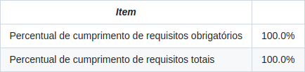
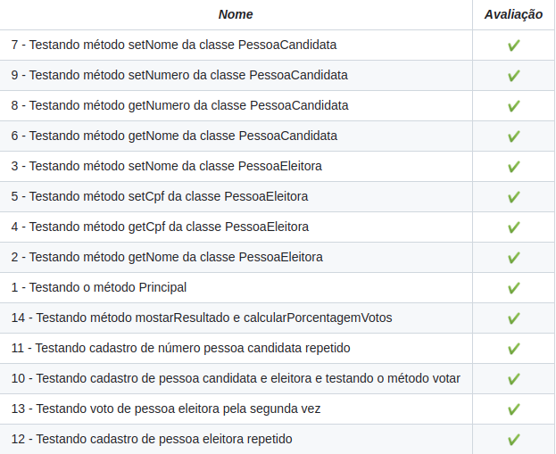

# Bem vindo ao repositório do projeto Sistema de votacao
Projeto da Trybe para aceleração em Java, visando aprimorar habilidades em POO. Desenvolvimento prático com criação de classes, objetos, herança, encapsulamento e interfaces. Resultado demonstra domínio em Java e compromisso com código limpo e eficiente.

## Resultado da avaliação


## Resultado por requisito


## O projeto contém 3 etapas.
1. **Cadastrar pessoas candidatas:** nessa etapa, há um menu para o cadastro de pessoas candidatas e, ao fim do cadastro de cada nova pessoa, oferece a opção de cadastrar outra. Quando não houver mais pessoas candidatas para serem cadastradas, então se passa para a etapa de cadastro de pessoas eleitoras;

2. **Cadastrar pessoas eleitoras:** aqui há menu que possibilita o cadastro de pessoas eleitoras, similar ao menu do cadastro de pessoas candidatas. Finalizado o cadastro, deve-se voltar ao estado inicial do menu de cadastro de pessoas eleitoras para oferecer a oportunidade de cadastrar uma nova pessoa. Quando não houver mais pessoas eleitoras para serem cadastradas, o sistema deve seguir para a etapa de votação;

3. **Iniciar processo votação:** nessa etapa é iniciado o processo de votação, aqui há um menu que oferece as opções de `votar`, `ver resultado parcial` e `finalizar a votação`. A seguir o detalhamento de cada caminho:
- Quando escolhida a opção `votar`, solicita-se o identificador da pessoa eleitora (por exemplo, o CPF) e o número da pessoa candidata em quem se deseja votar. Depois do voto, o menu volta ao estado inicial desta etapa, oferecendo as opções `votar`, `ver resultado parcial` e `finalizar a votação`.
- A opção `ver resultado parcial` lista todos os nomes das pessoas candidatas, mostrando a quantidade de votos absolutos recebida por cada pessoa candidata e o percentual de votos entre elas. Depois de ver o resultado parcial, o menu volta ao estado inicial desta etapa, oferecendo as opções `votar`, `ver resultado parcial` e `finalizar a votação`.
- A opção `finalizar a votação` mostra o resultado da votação listando as pessoas candidatas, o número absoluto de votos por pessoa candidata e também o percentual dos votos totais que cada pessoa candidata recebeu. Com o fechamento do processo de votação, o programa é finalizado.


### Exemplo:
```
----------- Votação iniciada! -----------

Entre com o número correspondente à opção desejada:
1 - Votar
2 - Resultado Parcial
3 - Finalizar Votação
1
Entre com o cpf da pessoa eleitora:
154.118.560-94
Entre com o número da pessoa candidata:
1
Entre com o número correspondente à opção desejada:
1 - Votar
2 - Resultado Parcial
3 - Finalizar Votação
1
Entre com o cpf da pessoa eleitora:
589.292.640-00
Entre com o número da pessoa candidata:
1
Entre com o número correspondente à opção desejada:
1 - Votar
2 - Resultado Parcial
3 - Finalizar Votação
1
Entre com o cpf da pessoa eleitora:
023.476.580-18
Entre com o número da pessoa candidata:
2
Entre com o número correspondente à opção desejada:
1 - Votar
2 - Resultado Parcial
3 - Finalizar Votação
3
Nome: Maria - 2 votos ( 67.0% )
Nome: José - 1 votos ( 33.0% )
Total de votos: 3
```
